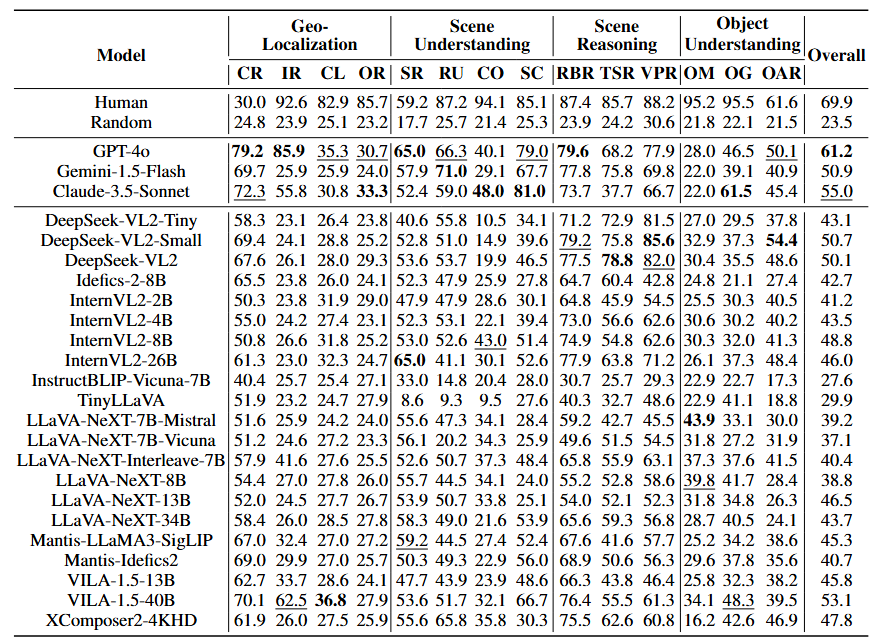

# <h2 align="center"> <a href="">UrBench: A Comprehensive Benchmark for Evaluating Large Multimodal Models in Multi-View Urban Scenarios</a><h5 align="center">

This repo contains evaluation code for the paper "[UrBench: A Comprehensive Benchmark for Evaluating Large Multimodal Models in Multi-View Urban Scenarios](https://arxiv.org/pdf/2408.17267)" [AAAI 2025]

[**🌐 Homepage**](https://opendatalab.github.io/UrBench/) | [**🤗 Dataset**](https://huggingface.co/datasets/bczhou/UrBench) | [**📑 Paper**](https://arxiv.org/pdf/2408.17267) | [**💻 Code**](https://github.com/opendatalab/UrBench) | [**📖 arXiv**](https://arxiv.org/abs/2408.17267)

## &#x1F389; News
* **🔥[2025.02.09]** UrBench now includes test results from [Deepseek-VL2](https://github.com/deepseek-ai/DeepSeek-VL2) model family!
* **🔥[2024.12.11]** UrBench has been accepted to AAAI 2025 main track!


## Introduction

We propose <b>UrBench</b>, a multi-view benchmark designed
to evaluate LMMs’ performances in urban environments.
Our benchmark includes 14 urban tasks that we categorize into various dimensions. These tasks encompass
both region-level evaluations that assess LMMs’ capabilities in urban planning, as well as role-level evaluations
that examine LMMs’ responses to daily issues.

<p align="center">

</p>


## Comparison with Existing Benchmarks
  <div class="container is-max-desktop">
    <div class="columns is-centered has-text-centered">
      <div class="column is-five-fifths">
        <div class="content has-text-justified" style="font-size: 20px">
          Compared to previous benchmarks, <b>UrBench</b> offers:
          <ul>
            <li> <i><b>Region-level and role-level questions.</b></i> <b>UrBench</b> contains diverse questions at both region and role level,
              while previous benchmarks generally focus on region-level questions.</li>
            <li> <i><b>Multi-view data.</b></i> <b>UrBench</b> incorporates both street and satellite data, as well as their paired-up cross-view data.
              Prior benchmarks generally focus on evaluations from a single view perspective.</li>
            <li> <i><b>Diverse task types.</b></i> <b>UrBench</b> contains 14 diverse task types categorized into four task dimensions,
              while previous benchmarks only offer limited task types such as counting, object recognition, etc.</li>
          </ul>
        <div class="column is-centered has-text-centered">
          
        </div>
        </div>
      </div>

  </div>


## Evaluation Results
<section class="section hero">
  <div class="container is-max-desktop">
    <div class="columns is-centered has-text-centered">
      <div class="column is-five-fifths">
        <div class="content has-text-justified">
          <!-- Qualitative Results -->
          <h3></h3>
         <div class="column is-centered has-text-justified">
           <p style="font-size: 20px;">
             UrBench poses significant challenges to current SoTA LMMs. We find that the best performing closed-source model GPT-4o and open-source model VILA-1.5-
             40B only achieve a <b>61.2%</b> and a <b>53.1%</b> accuracy, respectively. Interestingly, our findings indicate that the primary
             limitation of these models lies in their ability to comprehend <b>UrBench</b> questions, not in their capacity to process multiple images, as the performance between multi-image and
             their single-image counterparts shows little difference, such as LLaVA-NeXT-8B and LLaVA-NeXT-Interleave in the table.
             Overall, the challenging nature of our benchmark indicates that current LMMs’ strong performance on the general
             benchmarks are not generalized to the multi-view urban scenarios.
           </p>
           
                 <figcaption style="font-size: 20px;text-align: center;">Performances of LMMs and human experts on the <b>UrBench</b> test set.</figcaption>
         </div>
          <!-- End Qualitative Results -->

  </div>
</section>


## 📊 Evaluation


### 🛠️ Installation
Please clone our repository and change to that folder
```bash
git clone https://github.com/opendatalab/Urbench.git
cd urbench
```

Create a new python environment and install relevant requirements
```bash
conda create -n urbench python=3.10
conda activate urbench
pip install -e .
```

### Start evaluating

Here's an example of running evaluation on UrBench's test set with TinyLLaVA
```bash
python -m accelerate.commands.launch --num_processes=2 --main_process_port=10043 -m lmms_eval --model=llava_hf --model_args="pretrained="bczhou/tiny-llava-v1-hf",device=""" --log_samples --log_samples_suffix tinyllava --tasks citybench_test_all --output_path ./logs
```


## Citation

```bibtex
@article{zhou2024urbench,
  title={Urbench: A comprehensive benchmark for evaluating large multimodal models in multi-view urban scenarios},
  author={Zhou, Baichuan and Yang, Haote and Chen, Dairong and Ye, Junyan and Bai, Tianyi and Yu, Jinhua and Zhang, Songyang and Lin, Dahua and He, Conghui and Li, Weijia},
  journal={arXiv preprint arXiv:2408.17267},
  year={2024}
}
```
